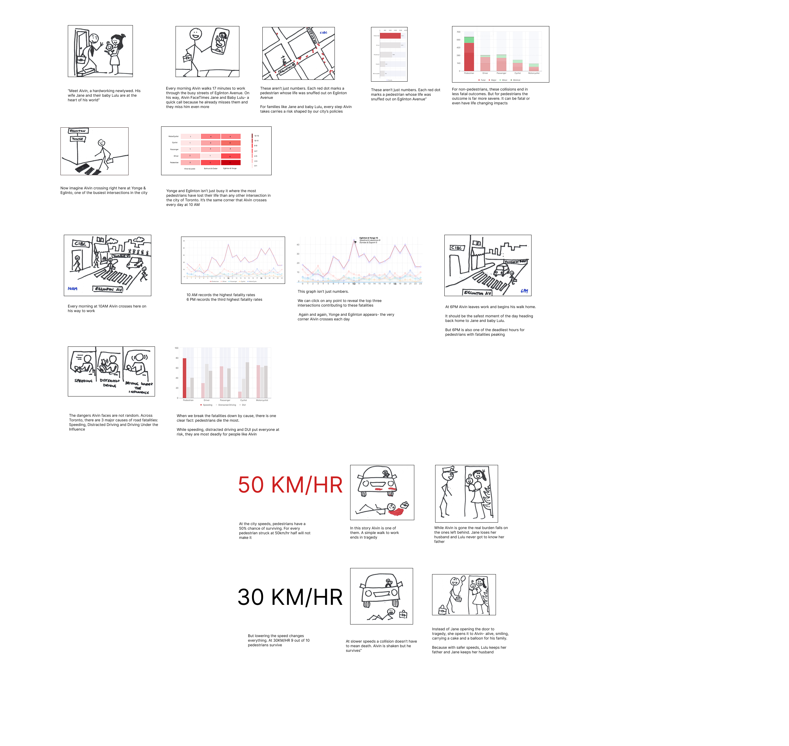
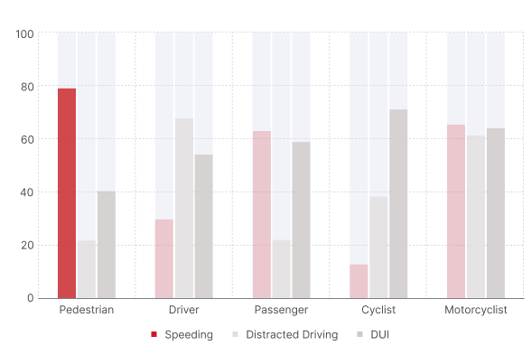
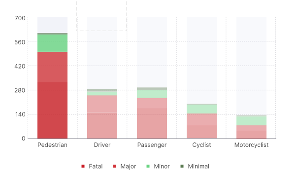
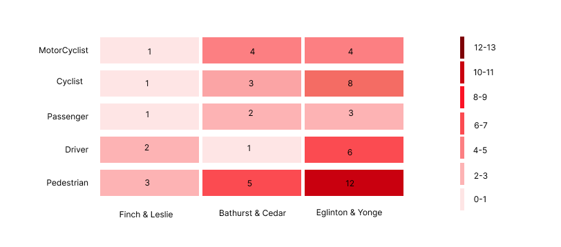
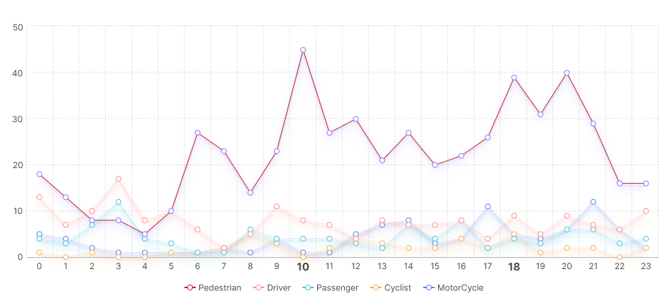

# Traffic Collision Data Storyboard Project Overview

This project explores how data storytelling can be used to communicate complex information through a narrative structure. Instead of presenting charts in isolation, the visualization is embedded within a storyboard centered on a fictional character named Alvin.

The story follows Alvin’s journey through the city while highlighting the risks and realities of traffic collisions using supporting data visualizations. Each scene in the storyboard integrates charts and visual elements that provide context to the narrative.

The goal of this project was to demonstrate how storytelling techniques can make statistical information more relatable, engaging, and easier to understand for non-technical audiences.

Project Objectives

The key objectives of this assignment were to:

Explore narrative-driven data visualization

Integrate statistical charts within a story format

Design a storyboard that guides readers through a structured sequence of insights

Communicate public safety data in a way that is accessible and memorable

# Story Structure

The storyboard uses a scene-based structure, where each frame represents a step in the narrative.

The story introduces Alvin and gradually connects his daily experiences with data about traffic collisions. As the story progresses, visualizations are introduced to highlight patterns such as:

Frequency of traffic collisions

Types of collisions

Risk factors affecting road safety

This format allows the audience to connect emotionally with the story while simultaneously understanding the data.

# Visual Components

The storyboard integrates several visual elements:

- Charts and graphs illustrating traffic collision statistics

- Sequential storyboard panels showing narrative progression

- Visual cues and annotations to guide interpretation of the data

These elements work together to create a cohesive narrative flow where the visuals reinforce the message of the story.

# Final Storyboard


# Visuals/
**Bar Graph:**




**Stacked Bar:**



**Heat map:**



**Line Graph:**



# Project Files
```text
│01-data-storyboard-traffic-collisions

├── README.md

└── Design-Process

    ├── collision-chart-1.png
    
    ├── collision-chart-2.png
    
    └── storyboard-scenes.png
 ```
   

# Key Learning Outcomes

This project reinforced several important principles of data storytelling:

**Narrative Drives Engagement**

Stories provide context that helps audiences connect with data.

**Visualizations Should Support the Message**

Charts should reinforce the story rather than overwhelm the audience.

**Simplicity Improves Understanding**

Effective storytelling focuses on clear insights rather than excessive detail.

**Context Makes Data Meaningful**

Embedding data within a narrative helps audiences understand why the information matters.

# Why Storyboarding Matters in Data Visualization

In many real-world scenarios, analysts must communicate insights to decision-makers who may not have technical backgrounds.

Storytelling techniques allow analysts to:

- translate complex data into understandable narratives

- guide audiences toward key insights

- make data-driven recommendations more persuasive

This project demonstrates how story-driven visualization can bridge the gap between data analysis and effective communication.

# Reflections (Lessons Learned)
- stickmen sketches should be substituted for actual animation
- use actual data in charts (not within project scope)
