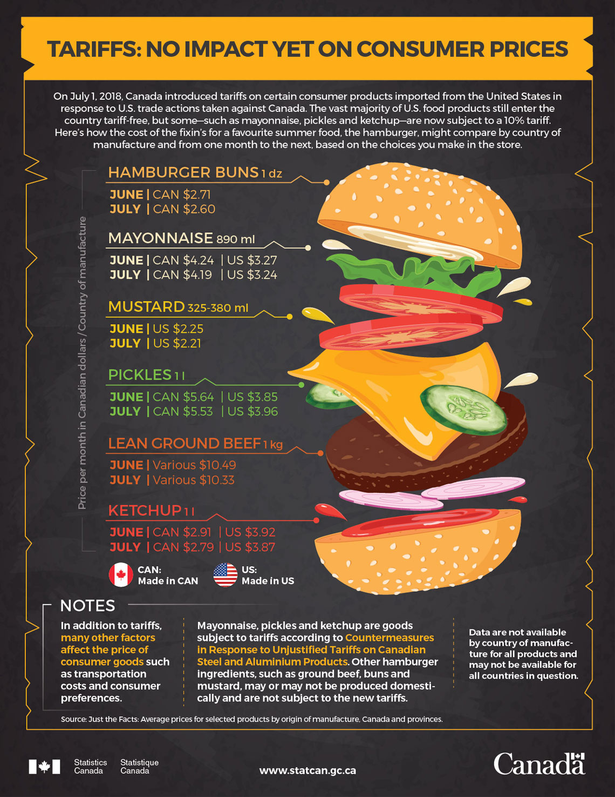

# Evaluation of a Statistics Canada Infographic Tariffs: No Impact Yet on Consumer Prices

# Project Overview

This project evaluates a public infographic produced by Statistics Canada titled “Tariffs: No Impact Yet on Consumer Prices.” The visualization communicates how newly implemented Canadian tariffs on select U.S. food products have not yet significantly affected consumer prices.

The objective of this assignment was to critically analyze the infographic’s design choices, clarity, and effectiveness in communicating complex economic data to a broad audience.

The analysis focuses on how visual storytelling techniques are used to simplify and communicate information related to tariffs, ingredient sourcing, and food pricing.



# Infographic Reference


The original infographic uses a visual metaphor of a hamburger to represent the different ingredients involved in hamburger production and their associated prices. This design helps communicate economic information in a familiar and engaging format.

# Purpose of the Infographic

The infographic aims to:

- Inform the public about the potential impact of Canadian tariffs on U.S. food imports

- Compare ingredient prices sourced from Canada and the United States

- Demonstrate that tariffs have not yet significantly affected consumer prices

- By presenting these comparisons visually, the infographic makes economic data more accessible to a general audience.

# Visualization Techniques Used

Several visualization techniques and design strategies were used in the infographic.

**Visual Metaphor**

The most distinctive design element is the hamburger stack visualization, where each ingredient represents part of the burger and its corresponding cost. This metaphor connects the economic data to a familiar everyday food item.

**Side-by-Side Comparisons**

Ingredient prices from Canada and the United States are presented side-by-side, allowing readers to easily compare costs between the two sources.

**Icon-Based Representation**

Icons are used to visually represent ingredients such as:

- beef

- lettuce

- tomatoes

- bread

This approach reduces reliance on text and makes the infographic easier to interpret quickly.

**Use of National Flags**

Canadian and U.S. flags are used to clearly distinguish between ingredients sourced from the two countries. This design choice reinforces the theme of cross-border trade and tariffs.

**Novel or Unconventional Design Elements**

The infographic uses several creative design techniques that differ from traditional chart formats.

1. Storytelling Through Visual Metaphor

The hamburger stack layout transforms a price comparison into a visual story. Each ingredient acts as a layer in the burger, making the economic comparison both intuitive and visually engaging.

2. Custom Graphic Layout

Instead of using standard charts such as bar graphs or pie charts, the infographic uses a custom graphic composition, likely created using a design canvas in infographic software. This allows the designer to combine icons, text, and numerical values within a cohesive visual narrative.

Data Transparency and Sources

A key part of the evaluation involved assessing whether the infographic clearly communicates its data sources and methodology.

**Is Actual Data Used?**

Yes. The infographic is based on real pricing data related to hamburger ingredients.

**Does the Graphic Reveal the Data Clearly?**

Yes. The individual ingredient prices are presented directly within the infographic, allowing readers to understand how each component contributes to the overall cost.

**Is the Data Transparent?**

The infographic is mostly transparent in its presentation of data. The values used in the visualization are clearly shown, and the source of the data is referenced.

**Are Sources Properly Cited?**

The data source is identified, which supports the credibility of the visualization. However, some contextual information, such as sample size or data collection methodology, is not discussed in detail.

# Key Takeaways

This evaluation highlights several lessons about effective data visualization design.

**Use of Visual Metaphors**

Visual metaphors can make complex topics more understandable by connecting them to familiar real-world objects.

**Simplicity Improves Communication**

By avoiding overly complex charts, the infographic allows viewers to quickly grasp the core message.

**Design Influences Interpretation**

The layout, icons, and visual structure guide how audiences interpret the data.

# Why This Analysis Matters

In many real-world contexts, data analysts must evaluate and critique existing visualizations produced by governments, organizations, and media outlets.

Understanding how visualizations communicate information helps analysts:

identify strengths and weaknesses in data presentation

improve their own visualization design

ensure that data communication remains clear, accurate, and transparent

This project demonstrates how critical analysis can help improve the effectiveness of data-driven communication.

# Project Structure
```text
│infographic-evaluation-statcan
├── README.md
└── Infographic
    ├── infographic.jpg   
└── data-link
    └── README.md
``` 

evaluation.md
Contains the full written critique and detailed analysis of the infographic.

statcan_infographic_reference.png
A reference image of the infographic being evaluated.

# Author

AfeenaG: Graduate Student – Business Analytics and Artificial Intelligence

This project is part of my academic portfolio demonstrating skills in:

data visualization critique

visual communication analysis

infographic evaluation

data storytelling
